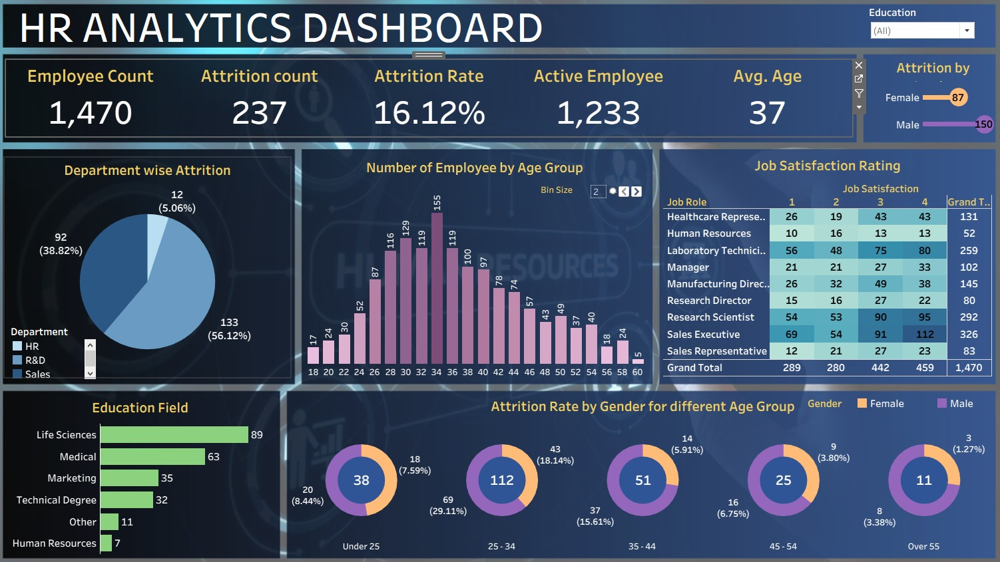

# 👩‍💼 HR Analytics Dashboard (Tableau Project)

## 📌 Project Overview
This project uses Tableau to analyze HR data and provide insights into employee performance, attrition, and workforce distribution.

## 🎯 Objectives
- Analyze employee attrition
- Understand workforce demographics
- Track department-wise performance
- Identify factors affecting employee retention

## 🛠 Tools Used
- Tableau
- Data Visualization
- Dashboard Design

## 📊 Key Insights
- Attrition rate analysis
- Department-wise employee distribution
- Gender and age insights
- Performance trends

## 📁 Files Included
- Tableau dashboard (.twbx)
- Dataset (if available)
- Dashboard screenshots

## 📸 Dashboard Preview

## 💡 Business Use Case
HR teams can:
- Reduce employee attrition
- Improve hiring strategies
- Enhance workforce planning

## 🚀 Conclusion
This dashboard helps organizations make data-driven HR decisions and improve employee satisfaction.

---
